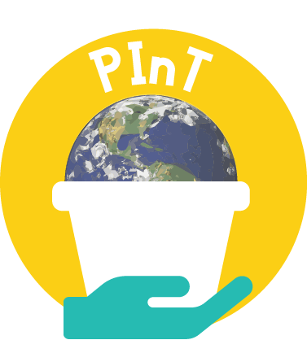

# PInT Summer Fellowship

PInT is launching our summer 2020 fellowship, which will place three Olin College students at summer internships within public interest organizations. Fellowship recipients can spend a summer practicing and deepening their powerful technical and creative skills for justice, equity, inclusion, and doing good in the world, at an organization they're passionate about.

[Fellowship Details](/fellowship)

<header class="page-header">

# PInT: Public Interest Technology

## BUILD WITH, NOT FOR

</header>

Engineers have a responsibility to society and to the world. We believe that the technology we create can and should be co-created with the public and serve the public interest. PInT is a student-led effort to cultivate pathways and opportunities for Olin's students, faculty, and staff to be creators, engineers, designers, artists, and activists who leverage their skills for justice, equity, inclusion, and doing good in the world.

Please join us if you are interested in:

*   Community-building and student leadership development
*   Exploring pathways for careers in public interest tech
*   Having local impact through public interest tech projects
*   Understanding the social and political dimensions of technology
*   Developing public interest tech skills through practice
*   Shaping the culture of engineering and education at Olin

<nav class="profiles">[Explainer ](https://docs.google.com/document/d/18TqPWYqX-RaoY391QaPW59I9bOb17OLLllcGPx2LfQg/edit)[Opportunities ](https://docs.google.com/document/d/1J7G_p2IJkhHEOqcqATpE2V3-zAbPwaeC0pZRigUgycg/edit)[Contact Us](https://forms.gle/HVonFKUoUbFDUper9)</nav>

Olin College is a charter member of the [Public Interest Technology University Network](https://www.newamerica.org/public-interest-technology/university-network/).

